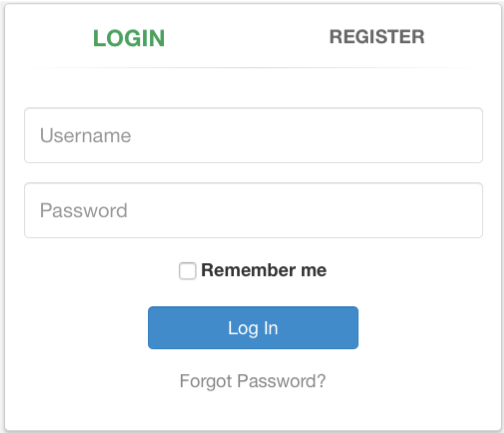

# Can you login as tom?
SQLi

## Challenge

> We now explained the basic steps involved in an SQL injection. In this assignment you will need to combine all the things we explained in the SQL lessons.\
> Goal: Can you login as Tom?\
> Have fun!

## Solution
We will exploit the register window.

If we try to register username `tom` it gives us this message:

	User tom already exists please try to register with a different username.

And if we try `tom' and '1'='1` we get:

	User tom' and '1'='1 already exists please try to register with a different username.
  
If we try another username such as `daniel' or '1'='1`:

	User daniel' or '1'='1 already exists please try to register with a different username.

But user daniel does not really exist because when running `daniel`we get:

	User daniel created, please proceed to login page
	

We can deduce that in the backend it executes a `select` sentence and when `true`, such as when you `or '1'='1`, it returns the *already exists* message. So if we were to enter `tom' and password='**toms password**` it would return that the user already exists and we would have toms password. We can bruteforce it trying different passwords until it returns that the user already exists, but the **LIKE** operator makes it much easier.

