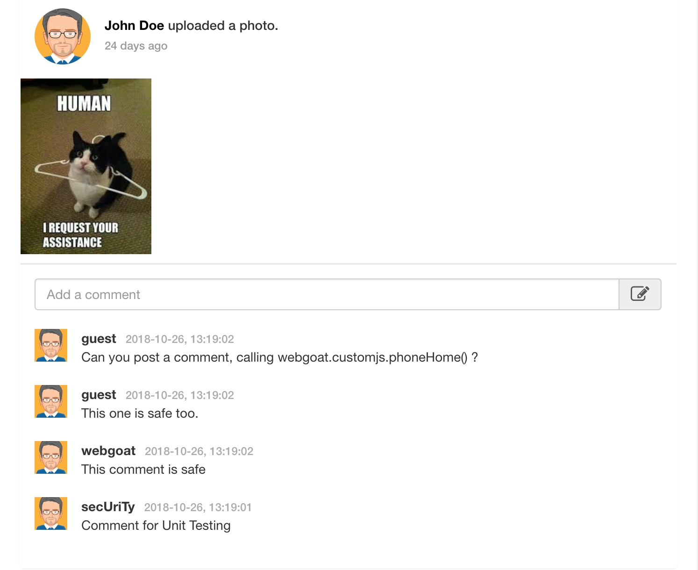
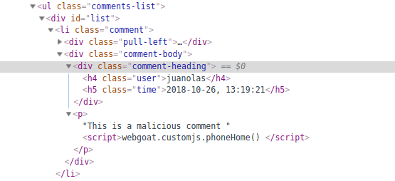
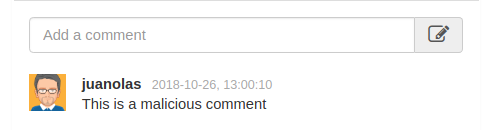
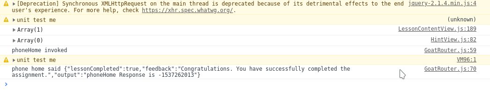

# Lesson 13
XSS
## Challenge

> See the comments below.
\
> Add a comment with a javascript payload. Again …​ you want to call the webgoat.customjs.phoneHome function.\
> As an attacker (offensive security), keep in mind that most apps are not going to have such a straight-forwardly named compromise. Also, you may have to find a way to load your own javascript dynamically to fully achieve goals of exfiltrating data.

## Solution

This DOM-based XSS attack consists of writing a malicious commment which will execute a script everytime the comments webpage is loaded.

If we type whatvever comment we like and add the following code to it: ``, the phoneHome function will be called.

We can see in the next images the comment we introduced and the comment that the page shows for all users.

 

When we refresh the page, the script is executed and gives the following output in the browser's console.

 
